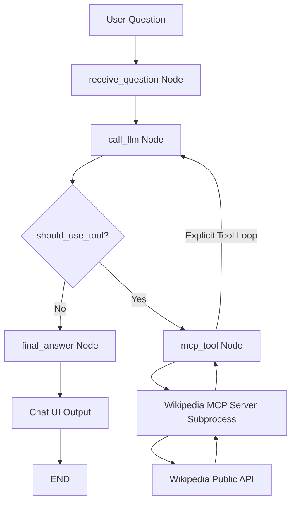
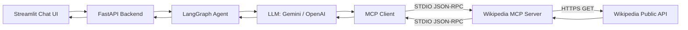

# 🌐 Wikipedia MCP Agent: Production-Style LangGraph Q&A Application

An enterprise-ready, production-grade **Question & Answer Agent** built with **Python 3.13**, **LangGraph**, the official **Model Context Protocol (MCP)** Python SDK, **Google Gemini** (or **OpenAI**), **FastAPI**, and a sleek **Streamlit** Chat UI.

---

## 📑 Table of Contents
1. [Overview & Core Objective](#overview--core-objective)
2. [How MCP Works in This Project](#how-mcp-works-in-this-project)
3. [Architecture Diagrams](#architecture-diagrams)
   - [LangGraph Workflow Diagram](#langgraph-workflow-diagram)
   - [MCP System Architecture Diagram](#mcp-system-architecture-diagram)
4. [Project Structure](#project-structure)
5. [Technology Stack](#technology-stack)
6. [The Actual Tool-Calling Code Walkthrough](#the-actual-tool-calling-code-walkthrough)
7. [Installation & Setup](#installation--setup)
8. [Running the Application](#running-the-application)
9. [Example Questions & Demonstrations](#example-questions--demonstrations)
10. [Testing](#testing)
11. [Logging & Observability](#logging--observability)
12. [Troubleshooting Guide](#troubleshooting-guide)

---

## 🎯 Overview & Core Objective

The primary objective of this project is to demonstrate a true, decoupled **Model Context Protocol (MCP)** architecture combined with **LangGraph Agentic Tool Calling**:

```
User Question in Streamlit Chat UI
                ↓
          FastAPI Backend
                ↓
         LangGraph Agent
                ↓
    LLM (Gemini 2.5 / OpenAI)
          Tool decision
                ↓
           MCP Client (stdio)
                ↓
      Wikipedia MCP Server
                ↓
     Wikipedia Public API
                ↓
      MCP Structured Result
                ↓
  LLM Answer Synthesis (with Sources)
                ↓
Streamlit UI Display with Tool Inspector
```

> [!IMPORTANT]
> **Strict Architectural Separation**: This project does **NOT** use LangChain's built-in `WikipediaQueryRun` or direct Wikipedia wrappers. The LLM interacts strictly with tools exposed through an **MCP Server** over the official Model Context Protocol via standard I/O (STDIO) JSON-RPC.

---

## 🔍 How MCP Works in This Project

In traditional agent implementations, tools are embedded in the same Python process as the LLM. In this project, the tools live in a standalone, isolated **MCP Server process** complying with the open **Model Context Protocol (MCP)** specification.

### Component Responsibilities:

| Component | Responsibility |
| :--- | :--- |
| **Streamlit Chat UI** (`frontend/streamlit_app.py`) | Provides conversational UI (`st.chat_message`, `st.chat_input`), multi-turn memory session management via `thread_id`, and expandable inspection of active MCP tool calls and source URLs. |
| **FastAPI Backend** (`app/main.py`, `app/api/routes.py`) | Exposes REST endpoints (`POST /chat`, `GET /health`), manages lifecycle state, and orchestrates requests into the LangGraph engine. |
| **LangGraph Agent** (`app/graph/workflow.py`) | Coordinates state transitions via a compiled `StateGraph` with an explicit tool-calling loop and `MemorySaver` checkpointer. |
| **LLM Layer** (`app/agent/agent.py`) | Powered by **Google Gemini** (`gemini-2.5-flash`) or **OpenAI** (`gpt-4o-mini`). Inspects context, evaluates user intent, and autonomously chooses when to trigger tools vs. answer directly. |
| **MCP Client** (`app/mcp/client.py`) | Spawns and manages the MCP Server subprocess, performs MCP handshake, discovers tool schemas via JSON-RPC, dispatches tool execution requests, and returns text content. |
| **Wikipedia MCP Server** (`mcp_server/server.py`) | A dedicated MCP server built using `mcp.server.mcpserver.MCPServer`. Listens on `stdio`, exposes tools, and executes queries against Wikipedia. |
| **Wikipedia Public API** (`mcp_server/wikipedia.py`) | Communicates with Wikimedia's Action API (`/w/api.php`) and REST API (`/api/rest_v1`), strips HTML tags, handles 429 rate-limiting, and normalizes canonical URLs. |

---

## 📊 Architecture Diagrams

### LangGraph Workflow Diagram



### MCP System Architecture Diagram



---

## 📂 Project Structure

```
Wikipedia mcp/
├── app/
│   ├── __init__.py             # Application package marker
│   ├── main.py                 # FastAPI app entrypoint & lifespan lifecycle
│   ├── config.py               # Pydantic BaseSettings configuration
│   ├── graph/
│   │   ├── __init__.py
│   │   ├── state.py            # TypedDict AgentState definition
│   │   ├── nodes.py            # LangGraph node factories
│   │   ├── edges.py            # Conditional routing edge (should_use_tool)
│   │   └── workflow.py         # StateGraph assembly & explicit loop
│   ├── agent/
│   │   ├── __init__.py
│   │   ├── agent.py            # LLM provider initialization (Gemini / OpenAI)
│   │   ├── prompts.py          # System, Wikipedia, and Answer prompt loader
│   │   └── tools.py            # MCP-to-LangChain StructuredTool adapter
│   ├── mcp/
│   │   ├── __init__.py
│   │   ├── client.py           # Official MCP stdio client & session manager
│   │   └── config.py           # Subprocess interpreter & timeout settings
│   ├── api/
│   │   ├── __init__.py
│   │   └── routes.py           # POST /chat and GET /health routes
│   └── models/
│       ├── __init__.py
│       └── schemas.py          # Pydantic request/response schemas
├── mcp_server/
│   ├── __init__.py
│   ├── server.py               # Official MCP Server (MCPServer on stdio)
│   ├── tools.py                # Tool parameters & schemas
│   └── wikipedia.py            # Resilient Wikipedia Action & REST API client
├── frontend/
│   └── streamlit_app.py        # Streamlit Chat interface with MCP inspector
├── prompts/
│   ├── system_prompt.txt       # Base agent instructions & role definition
│   ├── wikipedia_prompt.txt    # Query formulation & disambiguation guidelines
│   └── answer_prompt.txt       # Answer synthesis & source citation rules
├── tests/
│   ├── test_mcp.py             # Wikipedia API & MCP client-server integration tests
│   ├── test_agent.py           # Prompt loading & tool schema tests
│   └── test_graph.py           # LangGraph StateGraph & tool loop tests
├── .env                        # Local active configuration (ignored by git)
├── .env.example                # Template configuration file
├── requirements.txt            # Pinned dependencies
├── pyproject.toml              # Build & pytest configuration
├── README.md                   # Complete architectural guide
└── run.py                      # Multi-command CLI runner
```

---

## 🛠️ Technology Stack

- **Language**: Python 3.13
- **Agent Orchestration**: `langgraph>=1.2.0`, `langchain-core>=1.6.0`
- **Protocol**: `mcp>=2.2.0` (Official Model Context Protocol SDK)
- **LLM Integrations**:
  - `langchain-google-genai>=4.4.0` (Google Gemini 2.5 Flash)
  - `langchain-openai>=1.6.0` (OpenAI GPT-4o-mini)
- **Backend API**: `fastapi>=0.115.0`, `uvicorn>=0.30.0`
- **Frontend UI**: `streamlit>=1.40.0`
- **Data Validation**: `pydantic>=2.10.0`, `pydantic-settings>=2.7.0`
- **Networking**: `httpx>=0.28.0`, `requests>=2.32.0`
- **Testing**: `pytest>=8.0.0`, `pytest-asyncio>=0.24.0`

---

## 💻 The Actual Tool-Calling Code Walkthrough

Here is the exact code demonstrating the full chain:
`LLM` ➔ `Tool Call` ➔ `MCP Client` ➔ `MCP Server` ➔ `Wikipedia API` ➔ `LLM Synthesis`:

### 1. Converting MCP Tools to LangChain Tools (`app/agent/tools.py`)
```python
def create_mcp_tool_wrapper(mcp_tool: Any, mcp_client: WikipediaMCPClient) -> StructuredTool:
    tool_name = mcp_tool.name
    tool_description = mcp_tool.description
    schema = KNOWN_SCHEMAS.get(tool_name, FallbackToolSchema)

    # STAGE 2 -> 3: Coroutine executed by LangGraph when LLM requests this tool
    async def _tool_coroutine(**kwargs: Any) -> str:
        logger.info(f"[LANGGRAPH] Tool dispatched: {tool_name} with params: {kwargs}")
        
        # STAGE 3: Call through official MCP Client over STDIO JSON-RPC
        mcp_result_text = await mcp_client.call_tool(tool_name=tool_name, arguments=kwargs)
        
        # STAGE 7: Return string back to LangGraph ToolNode / StateGraph
        return mcp_result_text

    return StructuredTool(
        name=tool_name,
        description=tool_description,
        coroutine=_tool_coroutine,
        args_schema=schema,
    )
```

### 2. MCP Client Transmission (`app/mcp/client.py`)
```python
async def call_tool(self, tool_name: str, arguments: Dict[str, Any]) -> str:
    # Sends JSON-RPC 2.0 tools/call request to the server process over stdio
    result = await self.session.call_tool(tool_name, arguments)
    return "\n".join([item.text for item in result.content if hasattr(item, "text")])
```

### 3. MCP Server Receiving and Executing (`mcp_server/server.py`)
```python
server = MCPServer(name="wikipedia-mcp-server")

@server.tool(name="search_wikipedia")
async def search_wikipedia(query: str, limit: int = 5) -> Dict[str, Any]:
    # STAGE 4: Calls Wikipedia Action API
    return await api_search_wikipedia(query=query, limit=limit)
```

### 4. Why the LangGraph Loop is Necessary (`app/graph/workflow.py`)
```python
# EXPLICIT TOOL CALLING LOOP: mcp_tool -> llm
workflow.add_edge("mcp_tool", "llm")
```
> **Explanation**: When the LLM decides to call a tool, it outputs a `tool_calls` request rather than a final text answer. The `mcp_tool` node invokes the MCP tool and records a `ToolMessage`. The workflow **must loop back to the `llm` node** so the model can inspect the retrieved Wikipedia facts and synthesize the human-readable answer.

---

## ⚡ Installation & Setup

### 1. Activate Virtual Environment
```bash
# macOS / Linux
source .venv/bin/activate

# Windows
.venv\Scripts\activate
```

### 2. Install Dependencies
```bash
pip install -r requirements.txt
```

### 3. Configure Environment Variables
Copy `.env.example` to `.env` (already configured for local Ollama `gemma4:latest` by default):
```bash
cp .env.example .env
```

Your [.env](file:///Users/athrvabhawsar07/Documents/Wikipedia%20mcp/.env) file is pre-configured for your local model:
```env
# Local Ollama with gemma4:latest (Default - No API Key Needed)
LLM_PROVIDER=ollama
OLLAMA_MODEL=gemma4:latest
OLLAMA_BASE_URL=http://localhost:11434

# Or switch to cloud providers if desired:
# LLM_PROVIDER=gemini
# GOOGLE_API_KEY=AIzaSy...your_gemini_key_here
# LLM_PROVIDER=openai
# OPENAI_API_KEY=sk-...your_openai_key_here
```

---

## 🚀 Running the Application

You can launch the entire stack using the unified `run.py` script or run components individually:

### Option A: Launch Everything Concurrently (Recommended)
```bash
python run.py all
```
This automatically starts:
- **FastAPI Backend**: `http://localhost:8000` (Swagger docs at `/docs`)
- **Streamlit Chat UI**: `http://localhost:8501`

---

### Option B: Run Services Individually

1. **Start the FastAPI Backend**:
   ```bash
   uvicorn app.main:app --reload --port 8000
   # or: python run.py api
   ```

2. **Start the Streamlit Chat UI**:
   ```bash
   streamlit run frontend/streamlit_app.py --server.port 8501
   # or: python run.py ui
   ```

3. **Run the MCP Server standalone in STDIO mode** (for MCP inspector/testing):
   ```bash
   python mcp_server/server.py
   # or: python run.py server
   ```

---

## 💡 Example Questions & Demonstrations

### Question 1: Factual Entity
> **User**: *"Who was Alan Turing?"*
- **LLM Decision**: Needs factual data ➔ Requests `search_wikipedia(query="Alan Turing", limit=3)`
- **MCP Client**: Dispatches call to MCP Server over stdio
- **Wikipedia MCP Server**: Queries Wikipedia Action API and returns summary
- **LLM Synthesis**: Generates biographical overview with patent/contribution dates and cites `https://en.wikipedia.org/wiki/Alan_Turing`.
- **UI Display**: Collapsible showing tool invocation + formatted answer + clickable source.

### Question 2: Multi-Turn Conversational Memory
> **User**: *"When was he born?"*
- **LLM Decision**: Recognizes "he" refers to Alan Turing from conversation state (`thread_id`) ➔ Answers: *"Alan Turing was born on 23 June 1912 in Maida Vale, London."*

### Question 3: Scientific Concept
> **User**: *"What is quantum mechanics?"*
- **LLM Decision**: Requests `search_wikipedia(query="Quantum mechanics")` and `get_wikipedia_summary(title="Quantum mechanics")`
- **Result**: Provides a concise overview of quantum mechanics, wave-particle duality, and historical origins with sources.

### Question 4: Casual Conversation (No Tool Call)
> **User**: *"Hello! How are you?"*
- **LLM Decision**: Casual greeting ➔ `should_use_tool` evaluates to `NO`
- **Result**: Direct conversational response without making any calls to Wikipedia.

---

## 🧪 Testing

The repository includes a comprehensive 12-point unit and integration test suite covering the Wikipedia API, MCP client-server stdio communication, tool schemas, routing edges, and the LangGraph loop.

Run the tests with:
```bash
python run.py test
# or: pytest tests/ -v
```

All 12 tests run asynchronously and mock live components where appropriate for speed and determinism.

---

## 🪵 Logging & Observability

### 1. Structured JSON Log File
All logs across the application (FastAPI backend, LangGraph agent, MCP client, and MCP server) are automatically formatted and written as **JSON Lines (`.jsonl`)** to:

```
logs/app.log.jsonl
```

Each log line is a standalone, machine-parseable JSON object:
```json
{
  "timestamp": "2026-09-28T06:40:53.687861+00:00",
  "level": "INFO",
  "logger": "mcp_server.server",
  "message": "[MCP SERVER] Tool called: search_wikipedia(query='Isaac Newton', limit=2)",
  "module": "server",
  "func_name": "search_wikipedia",
  "line": 45,
  "process_id": 8589,
  "thread_name": "MainThread"
}
```

### 2. Human-Readable Console Stream
Simultaneously, readable diagnostic logs are displayed in your terminal:

```text
2026-09-26 15:42:16 [INFO] [USER] Who was Alan Turing?
2026-09-26 15:42:16 [INFO] [LANGGRAPH] Calling LLM
2026-09-26 15:42:16 [INFO] [LLM] Tool requested: search_wikipedia (args={'query': 'Alan Turing', 'limit': 3})
2026-09-26 15:42:16 [INFO] [EDGES] Tool decision: YES -> Routing to 'mcp_tool'
2026-09-26 15:42:16 [INFO] [MCP CLIENT] Calling search_wikipedia with arguments: {'query': 'Alan Turing', 'limit': 3}
2026-09-26 15:42:16 [INFO] [MCP SERVER] Searching Wikipedia: 'Alan Turing' (limit=3)
2026-09-26 15:42:16 [INFO] [MCP SERVER] Found 3 results for 'Alan Turing'
2026-09-26 15:42:16 [INFO] [MCP CLIENT] Tool result received for search_wikipedia
2026-09-26 15:42:17 [INFO] [LANGGRAPH] Calling LLM
2026-09-26 15:42:17 [INFO] [LLM] No tools requested; direct text response generated.
2026-09-26 15:42:17 [INFO] [EDGES] Tool decision: NO -> Routing to 'final_answer'
2026-09-26 15:42:17 [INFO] [LLM] Generating final answer
```

---

## 🔧 Troubleshooting Guide

### 1. Wikipedia API Rate Limiting (429)
- **Symptom**: `Wikipedia rate limit (429) encountered`.
- **Cause**: Wikimedia requires all automated clients to supply a descriptive `User-Agent` with contact information (email or repository URL). Generic agents like `example.com` or default curl/httpx user agents are automatically blocked.
- **Fix**: The default header in `.env` is configured with `WIKIPEDIA_USER_AGENT="WikipediaMCPAgentBot/1.0 (https://github.com/athrvabhawsar07/wikipedia-mcp-agent; athrvabhawsar07@gmail.com)"`. Ensure this value is present.

### 2. Python Interpreter Not Found for Subprocess
- **Symptom**: `FileNotFoundError: [Errno 2] No such file or directory: 'python'`.
- **Cause**: macOS does not ship with a binary named `python` in `/usr/bin`, only `python3`.
- **Fix**: `app/mcp/config.py` automatically resolves `sys.executable` (pointing to `.venv/bin/python`), guaranteeing the current virtual environment's interpreter is always used.

### 3. LLM API Key Missing
- **Symptom**: `LLM API Authentication failed`.
- **Fix**: Add your API key to `.env`:
  - For Gemini: `GOOGLE_API_KEY=AIzaSy...`
  - For OpenAI: `OPENAI_API_KEY=sk-...`

### 4. MCP Stdio Transport Discipline
- **Symptom**: `MCPError: Connection closed` or JSON parsing error.
- **Cause**: If any code in `mcp_server` prints plain text directly to `sys.stdout`, it corrupts the JSON-RPC pipe.
- **Fix**: `mcp_server/server.py` strictly configures logging to `sys.stderr`, leaving `sys.stdout` exclusively for JSON-RPC messages.
